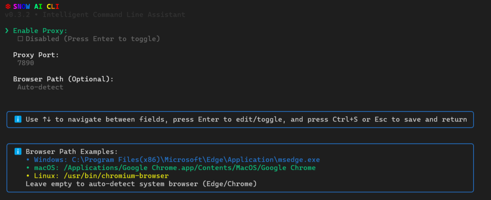

# Snow CLI

[](https://www.npmjs.com/package/snow-ai)
[](https://github.com/MayDay-wpf/snow-cli/blob/main/LICENSE)

<div align="center">


# Snow CLI 

**English** | [中文](README_zh.md)

_An intelligent AI-powered CLI tool for developers_

**QQ群**: 910298558
</div>


## 🚀 Why Snow CLI?

- **🎯 Multi-Model Support**: Compatible with OpenAI, Anthropic, Gemini, and any OpenAI-compatible APIs
- **🔧 Built-in Tools**: File operations, shell commands, web fetching, and search capabilities
- **🔌 Extensible**: MCP (Model Context Protocol) support for custom integrations
- **💻 Terminal-First**: Designed for developers who live in the command line
- **🛡️ Open Source**: Fully open source and community-driven
- **📦 IDE Integration**: VSCode and JetBrains plugins for seamless workflow


## 📋 Key Features

### Code Understanding & Generation

- Query and edit large codebases with AI assistance
- Generate new applications from natural language descriptions
- Debug issues and troubleshoot with intelligent suggestions
- Multi-file context awareness for better code understanding

### Automation & Integration

- Automate operational tasks with AI-powered workflows
- Use MCP servers to connect new capabilities and tools
- Run non-interactively in scripts for workflow automation
- IDE integration for seamless development experience

### Advanced Capabilities

- **Multiple Configuration Profiles**: Switch between different API and model configurations
- **Conversation Checkpointing**: Save and resume complex sessions with `/resume`
- **Custom System Prompts**: Tailor AI behavior for your specific needs
- **File Snapshots**: Automatic rollback capability for AI-made changes
- **Yolo Mode**: Unattended execution for trusted operations
- **Token Caching**: Optimize token usage with intelligent caching


## 📦 Installation

### Pre-requisites

- Node.js version 16 or higher
- npm >= 8.3.0
- macOS, Linux, or Windows

### Check Your Node.js Version

```bash
node --version
```

If your version is below 16.x, please upgrade:

```bash
# Using nvm (recommended)
nvm install 16
nvm use 16

# Or download from official website
# https://nodejs.org/
```

### Quick Install

#### Install globally with npm

```bash
npm install -g snow-ai
```

#### Build from source

```bash
git clone https://github.com/MayDay-wpf/snow-cli
cd snow-cli
npm install
npm run link   # builds and globally links `snow`
# to remove the link later: npm run unlink
```

### IDE Extensions

#### VSCode Extension

- Download [snow-cli-x.x.x.vsix](https://github.com/MayDay-wpf/snow-cli/releases/tag/vsix)
- Open VSCode, click `Extensions` → `Install from VSIX...` → select the downloaded file

#### JetBrains Plugin

- Download [JetBrains plugins](https://github.com/MayDay-wpf/snow-cli/releases/tag/jetbrains)
- Follow JetBrains plugin installation instructions


## 🚀 Quick Start

After install snow and Extension/plugin, start Snow CLI in terminal. 

### Basic Usage

#### Start in current directory

```bash
snow
```

#### Update to latest version

```bash
snow --update
```

#### Check version

```bash
snow --version
```

#### Resume latest conversation (fully compatible with Claude Code)

```bash
snow -c
```


## 🔐 API & Model Configuration

Snow CLI supports multiple AI providers and allows you to save multiple configuration profiles. From `v0.3.2` onward the bundled vendor SDKs were removed to keep the tool lightweight, so everything is configured through API & Model Settings.

### Configuration Options

After starting Snow CLI, enter `API & Model Settings` to configure:


- **Profile**: Switch or create new configurations for different API setups
- **Base URL**: Request endpoint for your AI provider
  - OpenAI/Anthropic: Requires `/v1` suffix
  - Gemini: Requires `/v1beta` suffix
- **API Key**: Your API key for authentication
- **Request Method**: Choose: 
  - Chat Completions - OpenAI-Compatible API
  - Responses - OpenAI's Responses API (Codex CLI)
  - Gemini - Google Gemini API
  - Anthropic - Anthropic Claude API
- **Anthropic Beta**: Enable beta features for Anthropic requests
- **Model Configuration**:
  - **Advanced Model**: High-performance model for complex tasks
  - **Basic Model**: Smaller model for summarization
  - **Compact Model**: Efficient model for context compression
  - All three model slots share the configured Base URL and API Key. Snow auto-fetches available models from the `/models` endpoint (with filtering); use Manual Input to specify a model name when the provider’s list is incomplete.
- **Max Context Tokens**: Model's maximum context window (e.g., 1000000 for Gemini). This only affects UI calculations for context percentage and does not change the actual model context.
- **Max Tokens**: Maximum tokens per response (added to API requests)


## 🚀 Getting Started

After configuring, click **Start** to open the conversation view. When launched from VSCode or other editors, Snow automatically connects to the IDE via the Snow CLI plugin and shows a connection message.


## 📚 Core Features

### File Selection & Commands

- **File Selection**: Use `@` to select files for context
  - In VSCode: Hold `Shift` and drag files for quick selection
- **Slash Commands**: Use `/` to access built-in commands
  - `/init` - Build project documentation `AGENTS.md`
  - `/clear` - Create a new session
  - `/resume` - Restore conversation history
  - `/mcp` - Check MCP connection status and reconnect
  - `/yolo` - Unattended mode (auto-approve all tool calls; use with caution)
  - `/ide` - Manually connect to IDE
  - `/compact` - Compress context (use sparingly)

### Keyboard Shortcuts

- **Windows**: `Alt+V` - Paste image
- **macOS/Linux**: `Ctrl+V` - Paste image (with prompt)
- `Ctrl+L` - Clear input from cursor to left
- `Ctrl+R` - Clear input from cursor to right
- `Shift+Tab` - Toggle Yolo mode
- `ESC` - Stop AI generation
- **Double-click `ESC`** - Rollback conversation with file checkpoints

### Token Usage Display

The input area shows real-time token statistics:
- Context usage percentage
- Total token count
- Cache hit tokens
- Cache creation tokens


## 🔧 Advanced Configuration

### Proxy & Browser Settings

Configure system proxy and search engine preferences:
- Automatic system proxy detection (usually no changes needed)
- Browser selection for web search (Edge/Chrome auto-detected unless you changed installation paths)
- Custom proxy port configuration



### Custom System Prompts

Customize AI behavior with your own system prompts:
- Supplements (does not replace) Snow's built-in prompt; the default prompt is downgraded to a user message and appended to your first user message
- Opens the system text editor for editing (Notepad on Windows; default terminal editor on macOS/Linux)
- Requires restart after saving (shows: `Custom system prompt saved successfully! Please use 'snow' to restart!`)

### Custom Headers

Add custom HTTP headers to API requests:
- Extends default headers (cannot override built-in headers)
- Useful for custom authentication or routing

### MCP Configuration

Configure Model Context Protocol servers:
- JSON format compatible with Cursor
- Extends Snow CLI with custom tools and capabilities
- Same editing workflow as system prompts


## 📁 Snow System Files

All Snow CLI files are stored in `~/.snow/`:

```
.snow/
├── log/                    # Runtime logs (local only, safe to delete)
├── profiles/               # Multiple API/model configurations
├── sessions/               # Conversation history for /resume
├── snapshots/              # File backups for rollback
├── todo/                   # Persisted todo lists
├── active-profile.txt      # Current active profile
├── config.json             # Main API configuration
├── custom-headers.json     # Custom request headers
├── mcp-config.json         # MCP service configuration
└── system-prompt.txt       # Custom system prompt
```


### File Management

- **Logs**: Local-only runtime logs; safe to delete for cleanup
- **Sessions**: Stored locally and required for conversation history features like `/resume`
- **Snapshots**: Automatic file checkpoints that enable rollback functionality
- **Todo**: Persists tasks so they survive unexpected exits


## 🤝 Contributing

We welcome contributions! Snow CLI is fully open source, and we encourage the community to:

- Report bugs and suggest features
- Improve documentation
- Submit code improvements
- Share your MCP servers and extensions

Visit our [GitHub repository](https://github.com/MayDay-wpf/snow-cli) to get started.


## 📖 Resources

- **[GitHub Repository](https://github.com/MayDay-wpf/snow-cli)** - Source code and issues
- **[NPM Package](https://www.npmjs.com/package/snow-ai)** - Package registry
- **[Releases](https://github.com/MayDay-wpf/snow-cli/releases)** - Download IDE extensions

## 📊 Star History

[](https://star-history.com/#MayDay-wpf/snow-cli&Date)

## 📄 Legal

- **License**: Open source (License Type TBC)
- **Privacy**: All data stored locally, no telemetry

---

<p align="center">
  Built with ❤️ by the open source community
</p>
