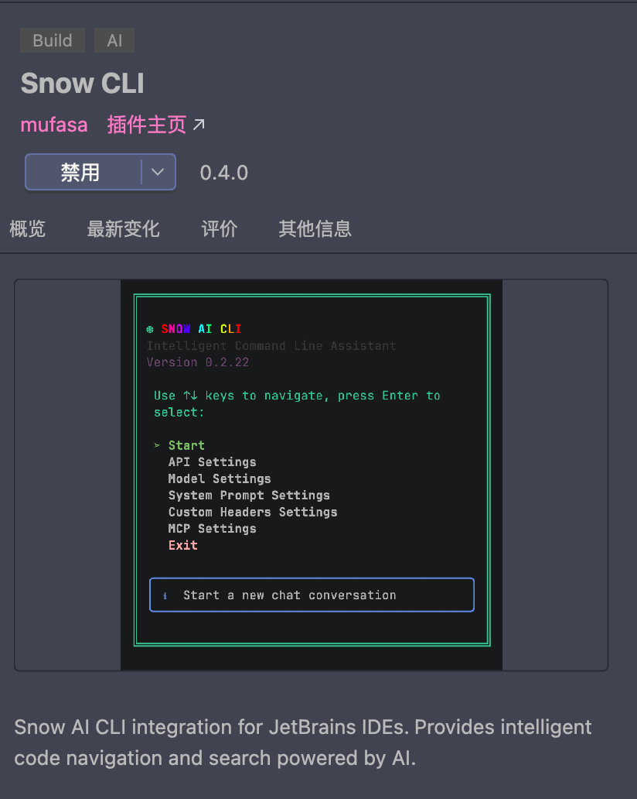

# Snow CLI 使用文档——安装指南

欢迎使用 Snow CLI！在终端中进行 Agentic 编程。

## 安装指南

### 1、系统环境要求

1. 操作系统：Windows 10+ / macOS 10.15+ / Ubuntu 18.04+ / CentOS 7+

2. node.js：v18.0.0+

3. npm: >= 8.3.0

### 2、安装 node.js + npm

1. Windows: [https://nodejs.org/en/download/](https://nodejs.org/zh-cn/download/) 下载安装包安装 node.js+npm

2. macOS: 通过 Homebrew 安装 node.js+npm

   ```bash
   brew install node
   ```

3. Linux: 通过 apt-get 安装 node.js+npm

   ```bash
   sudo apt-get install nodejs
   sudo apt-get install npm
   ```

4. 验证安装成功

   ```bash
   node -v
   npm -v
   ```

### 3、安装 Snow CLI 与 IDE 插件

1. 使用 npm 安装 Snow CLI

   ```bash
   npm install -g snow-ai
   ```

2. 编译 Snow CLI 源码安装

   ```bash
   git clone https://github.com/MayDay-wpf/snow-cli
   cd snow-cli
   npm install
   npm run build
   npm run link
   ```

3. 验证安装成功

   ```bash
   snow --version
   snow --help
   ```

4. 安装 VSCode 插件

   在扩展市场中搜索 `Snow CLI` 并安装

   
   安装完成后在 VSCode 右上角会出现启动图标

   

5. VSCode 扩展设置

   安装 VSCode 插件后，可以在 `设置` 中搜索 `Snow CLI` 进行以下配置：

   #### 常规

   - **终端模式** (`snow-cli.terminalMode`)：选择终端显示模式。默认为 `sidebar`。
     - `sidebar`（默认）：在侧边栏面板中嵌入终端。
     - `split`：在编辑器右侧分屏打开终端。
   - **启动命令** (`snow-cli.startupCommand`)：终端启动时运行的命令。默认为 `snow`。支持逗号分隔的多个命令，按轮询顺序分配给多个终端。

   #### 终端

   - **Shell 类型** (`snow-cli.terminal.shellType`)：侧边栏终端使用的 Shell。默认为 `auto`，跟随 VS Code 默认终端配置。也可以指定自定义 Shell 路径（如 `C:\Program Files\Git\bin\bash.exe`、`/usr/bin/zsh`）。
   - **代理 URL** (`snow-cli.terminal.proxyUrl`)：可选代理 URL，作为 `HTTP_PROXY`/`HTTPS_PROXY` 注入 Snow CLI 终端。三种模式：
     - 留空：回退到 VS Code 的 `http.proxy` 设置。
     - 填入 `null`：显式禁用代理，不继承 VS Code 的 `http.proxy`。
     - 填入 URL（如 `http://127.0.0.1:7890`）：直接使用该代理。
   - **字体** (`snow-cli.terminal.fontFamily`)：侧边栏终端字体。留空使用默认等宽字体。
   - **字号** (`snow-cli.terminal.fontSize`)：侧边栏终端字号（px）。默认为 `14`（范围：8–32）。
   - **字重** (`snow-cli.terminal.fontWeight`)：侧边栏终端字重。默认为 `normal`。可选：`normal`、`bold` 或数值 `100`–`900`。
   - **行高** (`snow-cli.terminal.lineHeight`)：侧边栏终端行高。默认为 `1`（范围：0.8–2）。
   - **背景色** (`snow-cli.terminal.backgroundColor`)：侧边栏终端背景色。默认为 `#181818`。支持任意 CSS 颜色值，如 `#181818`、`rgb(24, 24, 24)` 或 `var(--vscode-terminal-background)`。

   #### 终端响铃

   - **启用** (`snow-cli.bell.enabled`)：启用终端响铃（BEL / `\x07`）。默认为 `true`。关闭后将同时禁用声音与视觉提示。
   - **音效** (`snow-cli.bell.sound`)：响铃音效风格。默认为 `beep`。可选：`beep`、`ding`、`chime`、`pluck`、`blip`、`none`（仅视觉闪烁）。
   - **音量** (`snow-cli.bell.volume`)：终端响铃音量。默认为 `0.5`（范围：0.0–1.0）。设为 `0` 则静音，但仍可使用视觉闪烁提示。
   - **视觉闪烁** (`snow-cli.bell.visualFlash`)：响铃时在终端面板上显示短暂的视觉闪烁。默认为 `true`。

   #### Git Blame

   - **启用** (`snow-cli.gitBlame.enabled`)：启用 Git Blame 标注，在当前行显示提交信息（作者、时间、消息），类似 GitLens。默认为 `false`。

   #### 行内补全

   - **启用** (`snow-cli.completion.enabled`)：启用 Snow CLI 行内 AI 代码补全。默认为 `false`。开启后会在输入时自动显示建议。
   - **接口协议** (`snow-cli.completion.provider`)：与补全模型通信使用的接口协议。默认为 `chat`。可选：
     - `chat`：OpenAI 兼容的 Chat Completions API（如 OpenAI、DeepSeek chat、OpenRouter、vLLM、Ollama）。
     - `fim`：OpenAI Completions API（FIM / 中间填充）。推荐用于 DeepSeek、Mistral codestral 等。
     - `responses`：OpenAI Responses API。
     - `gemini`：Google Gemini API。
     - `anthropic`：Anthropic Messages API。
   - **Base URL** (`snow-cli.completion.baseUrl`)：补全 API 的 Base URL。留空则使用所选 Provider 的默认地址。
   - **API Key** (`snow-cli.completion.apiKey`)：补全 Provider 的 API Key。会保存在 VS Code 设置中，建议使用工作区作用域或在受限环境中使用。
   - **模型** (`snow-cli.completion.model`)：用于行内补全的模型名称。可通过命令“Snow CLI: Select Completion Model”从 API 拉取列表选择。
   - **最大 Token 数** (`snow-cli.completion.maxTokens`)：每次补全建议生成的最大 Token 数。默认为 `256`（范围：16–4096）。
   - **温度** (`snow-cli.completion.temperature`)：补全采样温度。默认为 `0.2`（范围：0–2）。值越低，生成结果越确定。
   - **防抖延迟** (`snow-cli.completion.debounceMs`)：停止输入后自动触发补全请求的防抖延迟（毫秒）。默认为 `400`（范围：50–5000）。
   - **上文行数** (`snow-cli.completion.contextPrefixLines`)：随请求发送的、光标之前的代码上下文行数。默认为 `120`（范围：10–1000）。
   - **下文行数** (`snow-cli.completion.contextSuffixLines`)：随请求发送的、光标之后的代码上下文行数。默认为 `40`（范围：0–500）。
   - **语言列表** (`snow-cli.completion.languages`)：启用行内补全的语言 ID 列表。默认为 `["*"]`（所有语言）。
   - **代理** (`snow-cli.completion.proxy`)：补全 API 请求使用的可选 HTTP/HTTPS 代理 URL。留空则不使用代理。

   #### 下一个编辑预测

   - **启用** (`snow-cli.nextEdit.enabled`)：启用 Snow CLI 下一个编辑预测。默认为 `false`。完成一次编辑后，会在当前文件（或工作区）中高亮可能需要做同类修改的位置，按 Tab 可逐个跳转并应用。
   - **搜索范围** (`snow-cli.nextEdit.scope`)：查找候选位置的搜索范围。默认为 `file`。可选：`file`（仅当前文件）、`workspace`（整个工作区，自动排除 `node_modules`、`dist`、`.git` 等目录）。
   - **使用 LSP 引用** (`snow-cli.nextEdit.useLspReferences`)：当被编辑的内容是单个标识符时，优先调用语言服务的引用查找（比纯文本搜索更精准）。默认为 `true`。查无结果时回退到文本搜索。
   - **最大候选数** (`snow-cli.nextEdit.maxCandidates`)：单次会话中最多保留的候选位置数量。默认为 `20`（范围：1–200）。
   - **最小模式长度** (`snow-cli.nextEdit.minPatternLength`)：触发预测所需的最小修改文本长度（字符数）。默认为 `2`（范围：1–20）。
   - **防抖延迟** (`snow-cli.nextEdit.debounceMs`)：停止输入后多久（毫秒）开始计算预测。默认为 `350`（范围：50–5000）。

6. 安装 Jetbrains IDE 插件

   在插件市场中搜索 `Snow CLI` 并安装

   插件安装成功后，重启 IDE
   

   在终端 `Tab` 右侧会有启动图标

   
