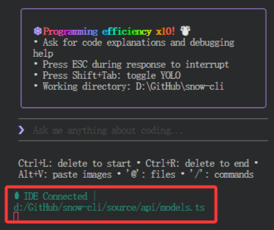

# snow-ai

> This readme is automatically generated by [create-ink-app](https://github.com/vadimdemedes/create-ink-app)

## Install

```bash
$ npm install --global snow-ai
```

## Start
```bash
$ snow
```

## Update
```bash
$ snow --update
```

## Config example  `./User/.snow/config.json`
```json
{
  "openai": {
    "baseUrl": "https://api.openai.com/v1",
    "apiKey": "your-api-key",
    "requestMethod": "responses",
    "advancedModel": "gpt-5-codex",
    "basicModel": "gpt-5-codex",
    "maxContextTokens": 200000,
    "compactModel": {
      "baseUrl": "https://api.openai.com/v1",
      "apiKey": "your-api-key",
      "modelName": "gpt-4.1-mini"
    }
  }
}
```

## Uninstall
```bash
$ npm uninstall --global snow-ai
```

## Install VSCode Extension

* download [VSIX/snow-cli-0.2.5.vsix](https://github.com/MayDay-wpf/snow-cli/blob/main/VSIX/snow-cli-0.2.5.vsix)

* open VSCode, click `Extensions` -> `Install from VSIX...` -> select `snow-cli-0.2.5.vsix`

## Live View
* **Welcome & Settings**


* **Agent**


* **Commands**

