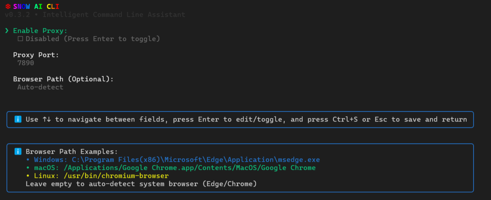

<div align="center">


# snow-ai

**English** | [中文](readme_zh.md)

*An intelligent AI-powered CLI tool for developers*

</div>

---


## Install

```bash
$ npm install --global snow-ai
```

## Start
```bash
$ snow
```

## Update
```bash
$ snow --update
```

## Config example  `./User/.snow/config.json`
```json
{
  "snowcfg": {
    "baseUrl": "https://api.openai.com/v1",//Gemini：https://generativelanguage.googleapis.com Anthropic：https://api.anthropic.com
    "apiKey": "your-api-key",
    "requestMethod": "responses",
    "advancedModel": "gpt-5-codex",
    "basicModel": "gpt-5-codex",
    "maxContextTokens": 32000, //The maximum context length of the model
    "maxTokens": 4096, // The maximum generation length of the model
    "anthropicBeta": false,
    "compactModel": {
      "baseUrl": "https://api.opeai.com/v1",
      "apiKey": "your-api-key",
      "modelName": "gpt-4.1-mini"
    }
  }
}
```

## Uninstall
```bash
$ npm uninstall --global snow-ai
```

## Install VSCode Extension

* download [VSIX/snow-cli-x.x.x.vsix](https://github.com/MayDay-wpf/snow-cli/blob/main/VSIX/)

* open VSCode, click `Extensions` -> `Install from VSIX...` -> select `snow-cli-0.2.6.vsix`

## Install JetBrains plugin

* download [JetBrains/build/distributions](https://github.com/MayDay-wpf/snow-cli/tree/main/JetBrains/build/distributions)

* File > Settings > Plugins

## Live View
* **Welcome & Settings**


* **Agent**


* In the middle of the conversation: click ESC to stop AI generation

* When mounting: double-click ESC, view the dialogue recorder, select rollback, including file checkpoints

* MacOS:`ctrl + v` Paste image
* Windows:`alt + v` Paste image


* **Commands**


  - /clear - Create a new session

  - /resume - The recovery history has

  - /mcp - Check the status of MCP service

  - /yolo - Unattended mode, all tools automatically agree to execute

  - /init - Initialize the project and generate the SNOW.md description document

  - /ide - Connect to VSCode, you need to install the plug-in

  - /compact - compress the context into a sentence

