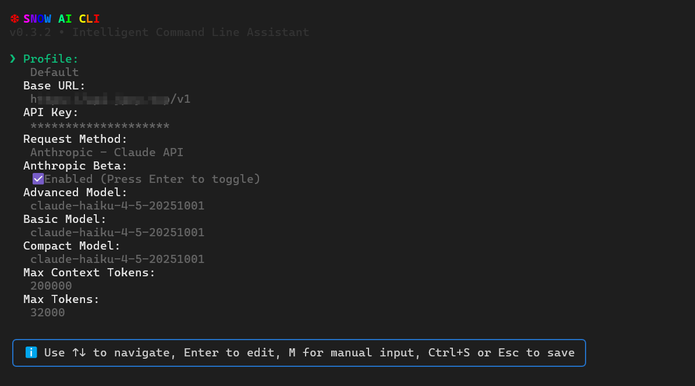

# snow-ai

[English](readme.md) | **中文**

*面向开发者的智能 AI 命令行工具*

# 一、安装
`$ npm install -g snow-ai`
也可前往：https://github.com/MayDay-wpf/snow-cli 使用源码编译安装
## 安装 VSCode 扩展

* 下载 [VSIX/snow-cli-x.x.x.vsix](https://github.com/MayDay-wpf/snow-cli/blob/main/VSIX/)

* 打开 VSCode，点击 `扩展` -> `从 VSIX 安装...` -> 选择 `snow-cli-0.2.6.vsix`

## 安装 JetBrains 插件

* 下载 [JetBrains/build/distributions](https://github.com/MayDay-wpf/snow-cli/tree/main/JetBrains/build/distributions)

## 可用命令
* 启动：`$ snow`
* 更新：`$ snow --update`
* 版本查询：`$ snow --version`
* 恢复最新的对话记录(完全复刻Claude Code)：`$ snow -c`

# 二、API & Model Settings
### 在最新的`v0.3.2`版本中移除了所有官方SDK(依赖太重了),所以配置会有轻微区别，启动后进入 `API & Model Settings` 可以看到如下内容
  - `Profile` 用于切换或新建配置，Snow现在支持保存多套API和模型方案
  - `Base URL` 请求地址，由于移除了官方SDK所以，OpenAI和Anthropic需要补`/v1`,Gemini需要补 `/v1beta`
  - `API Key` 没啥好说的，Key呗
  - `Request Method` 请求方案，按照你的需要选择：`Chat Completions`、`Responses`、`Gemini`、`Anthropic`
  - `Anthropic Beta` 这个复选框如果勾选，Anthropic的请求URL会自动补一个 `beta=true`的参数
  - `Advanced Model`、`Basic Model`、`Compact Model` 这三个分别设置：高级模型干活的、小模型总结的、压缩模型压缩上下文用的，这三个模型都来源于上面设置的 `BaseURL`和`API Key`,系统会自动请求对应的 `/models` 接口获取列表,支持键入过滤,当然遇到模型接口列表不完善的API,应用提供了 `Manual Input (Enter model name)`选项，可自行输入模型名称
  - `Max Context Tokens` 模型的最大上下文窗口，用于计算上下文百分比用的，可以根据模型实际情况填写，例如 `gemini` 一般是 1M上下文，就填 1000000，这个参数不会影响实际的模型上下文，只会影响界面的计算结果
  - `Max Tokens` 这个不能乱填，这个参数会直接加入API请求体中，作为 `max_tokens` 参数
  

# 三、Proxy & Browser Settings
### 用户设置系统代理端口，以及联网搜索的搜索引擎，一般情况下，这是不需要修改的，因为即便不设置，实测也会自动走代理除非有特殊抓包需求要走特定端口。同时，应用会自己寻找可能的搜索引擎路劲，Edge/Chrome 系统只要装了，基本都可以用，除非手动修改过Edge的下载位置

# 四、System Prompt Settings
### 顾名思义，用户可以自己设置系统提示词，需要注意的是，这并不能替换Snow本来的系统提示词，当用户设置了系统提示词，Snow自带的系统提示词将降级为用户消息，补充到第一条用户消息中，在`Windows`系统中，应用会自动唤醒`记事本`，`MacOS/Linux`中会启用系统自带的终端文本编辑器，编辑完保存即可生效，Snow会关闭，并提醒用户重启应用生效 `Custom system prompt saved successfully! Please use `snow` to restart!`

# 五、Custom Headers Settings
### 用户可以自定义添加请求头，注意是添加，用户无法覆盖Snow自带的请求头
# 六、MCP Settings
### 基操，用来配置MCP的，方法和设置系统提示词一模一样，Json格式和Cursor一模一样

# 七、一切准备就绪进入到对话页 `Start`
* 如果你在`vscode`等编辑器中启动，Snow会自动使用 `Snow CLI` 插件连接 IDE，你会看到这样的信息，插件都已经发布线上版本，直接在插件市场搜索 `Snow CLI` 即可安装

* 使用 `@` 可以选择文件，当然vscode最方便的操作还是长按`shift` 拖拽文件，效果一致
* 使用 `/` 可查看可用命令, 
  - `/init` 构建项目说明书 `SNOW.md`
  - `/clear` 新建会话
  - `/resume` 恢复历史记录
  - `/mcp`查看MCP连接状态，以及重连
  - `/yolo` 无人值守模式，任何工具调用都不会二次确认，比较危险
  - `/ide`手动连接IDE，基本不需要使用，因为会自动连，如果安装了IDE插件的话
  - `/compact`压缩上下文，很少使用，因为压缩后AI效果并不佳
* 快捷键
  - Windows:`Alt+V` 粘贴图片、MacOS/Linux:`Ctrl+V`(会有提示)
  - `Ctrl+L` 从光标位置开始向左清空输入框
  - `Ctrl+R` 从光标位置开始向右清空输入框
  - `Shift+Tab` 启用或禁用 `Yolo` 模式
  - `ESC` 中断AI生成
  - 双击`ESC` 回滚对话（系统自带检查点，可回滚文件）
* Token 使用情况（输入框下方会显示上下文占用百分比和token数、缓存命中token数、缓存创建token数）

# 八、Snow的系统文件
### 在用户目录的 `.snow` 文件夹中有Snow的所有文件，下面一个一个解释

* `log` 该目录主要记录了运行日志，这些日志不会上传任何远端，仅留在本地用于出现BUG时方便定位，可任意删除
* `profiles` 前文中提到，Snow支持多个配置文件切换，用户自定义的多个配置文件都将保存在这个目录
* `sessions` 该目录保存了用户的所有对话记录，同样是用于 `/resume` 以及其他功能实现的必要目录，不会上传任何远端
* `snapshots` 该目录保存了AI自动编辑文件前的快照，用于文件回滚，一般情况无需查看该目录，一切都是自动的
* `todo` 该目录文件是每次对话的 `todo` 列表持久化，避免因为意外退出，而导致AI忘记任务的情况
* `active-profile.txt` 因为Snow的早期版本不支持多个配置文件，所以为了向下兼容，新建了一个文本文件，用于标识用户当前使用的是哪个配置文件
* `config.json` 无需多言，最重要的API配置信息
* `custom-headers.json` 自定义请求头的内容
* `mcp-config.json` 自定义MCP服务的内容
* `system-prompt.txt` 自定义系统提示词的内容